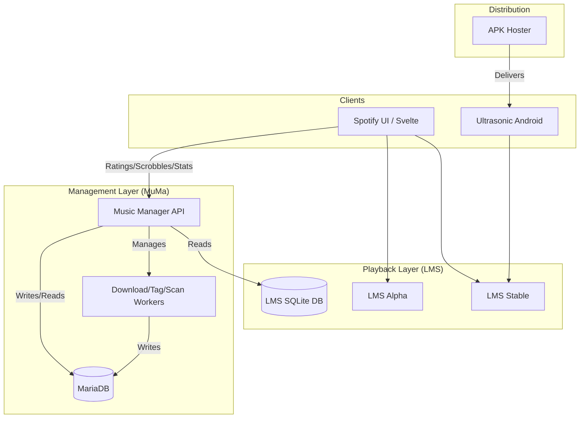
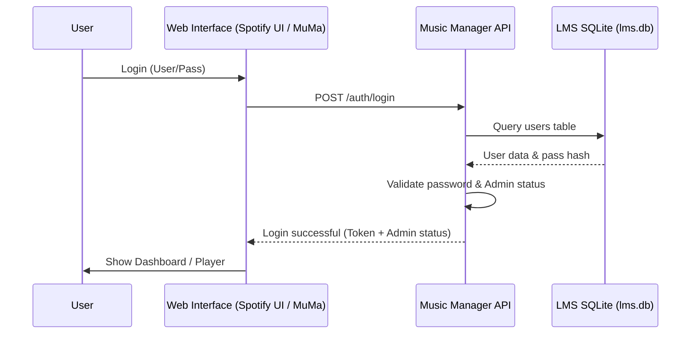
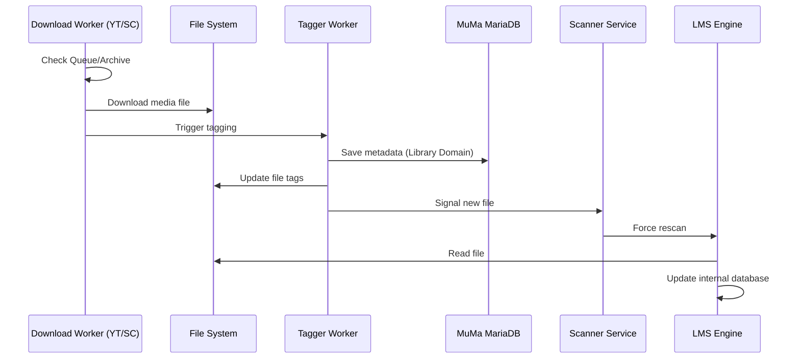
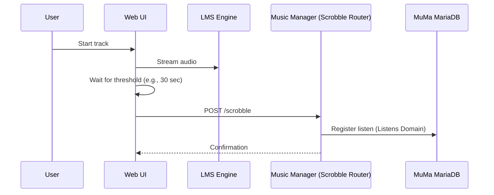

### MuMa Ecosystem Architecture

This document describes the architecture of the MuMa (Music Management) ecosystem. It is intended to provide AI models with quick insight into the components, their responsibilities, and their mutual relationships.

#### 1. Overarching Structure
The ecosystem is divided into three main layers:
- **Management & Data Hub (MuMa)**: The "source of truth" and management layer.
- **Playback & Interface (LMS / Spotify UI)**: The layer where the user interacts with the music.
- **Client & Distribution (Ultrasonic / APK Hoster)**: Mobile access and delivery.

---

#### 2. Music Manager (`music-management`)
The core management functions are consolidated into a unified service to streamline operations and reduce container overhead.

- **Music Manager (Consolidated API)**: A single high-performance FastAPI service that integrates:
    - **Management/Dashboard**: The backend for the `muma.teunschriks.nl` dashboard.
    - **User Service**: The central authentication authority. 
        - *Integration*: Validates login credentials and checks admin status by directly querying the LMS `lms.db`.
    - **Scrobble & Stats Services**: Process listening history and generate statistics.
    - **Rating System**: Manages track ratings that must remain consistent across the entire ecosystem.
    - **Artist Image Fetcher**: Centrally fetches artist images and provides them via an API endpoint.
- **Workers**: Specialized background processes for data processing:
    - `importer_worker`: Processes new music files.
    - `youtube/soundcloud/telegram_worker`: Automate downloading of new tracks.
    - `tagger_worker`: Enriches files with metadata.
    - `scanner_service`: Fills the library with track information.
    - `ml-analyzer`: Machine learning for automatic tagging and audio feature extraction.

---

#### 3. Audio Engine & Frontends (`lms`)
Lightweight media server (lms) acts as the audio engine, but the user experience is provided by a custom Spotify-style interface.

- **Stable Instance (`lms.teunschriks.nl`)**: The stable version for daily use.
- **Alpha Instance (`lms-alpha.teunschriks.nl`)**: Used for testing new UI features.
- **Data Volatility**: The data within LMS (such as the library database) is considered volatile. If the LMS container is deleted, it can be rebuilt from the music collection on disk. The actual metadata and listening history are stored in the MuMa services.

---

#### 4. Mobile Client & Distribution
- **Ultrasonic**: An Android client that connects to the music collection via the Subsonic API (provided by LMS).
- **APK Hoster**: A specific service that hosts the compiled Ultrasonic APK. 
    - *Why*: This allows the administrator to push updates of the mobile client without intervention from official app stores.
    - *Network*: APK Hoster is connected to the `music-management_db` network for potential configuration and logging.

---

#### 5. Dataflow & Authentication
1. The user logs in to MuMa Control or the Spotify UI.
2. The `user-service` validates the credentials against the `lms.db`.
3. Upon successful login as an admin, the user gains access to management functions (e.g., starting workers, viewing logs).
4. Listening activity is reported from the frontends to the `scrobble-service`.
5. Dynamic playlist definitions (smart playlists) are synchronized to MuMa as a central registry. Each definition is explicitly linked to a MuMa `user_id` (via internal mapping from `lms_user_id`) to maintain consistency and user-specific rules across different LMS instances.
6. Clients like **Ultrasonic** can synchronize their local application settings to the `Music Manager API`. These settings are stored in the MariaDB, providing a server-side backup that survives app re-installs or device switches.

---

#### 6. Database Architecture
The system uses different databases to keep metadata, playback state, and distribution separate.

##### A. MuMa Main Database (MariaDB)
The central database for all enriched metadata and user statistics. It is divided into four logical domains:

1.  **Library Domain (`library`)**: The "Source of Truth" for the collection.
    - `library_tracks`: Central track table with `track_uid` (unique hash).
    - `library_media_files`: Physical file paths, hashes, and links to tracks.
    - `library_artists` & `library_artist_aliases`: Normalization of artist names.
    - `library_track_artists`: Link table with roles (primary, remixer, producer, etc.).
    - `library_track_audio_features`: ML-based audio features (tempo, MFCC, etc.).
    - `library_track_ml_labels` & `ml_predictions`: Ground truth and model results for automatic tagging.

2.  **Listening Domain (`listens`)**: Registers the listening history.
    - `scrobble_listens`: Confirmed listens linked to tracks in the library.
    - `scrobble_unmatched_listens`: Listens that could not (yet) be linked to the library (e.g., due to missing scans).
    - `rating_tracks`: User ratings for tracks, synchronized across the ecosystem.

3.  **Tagger Domain (`rules`)**: Contains the knowledge for classification and normalization.
    - `rules_genres`, `rules_artist_genres`, `rules_label_genres`: Manual and automatic rules for genre assignment.
    - `rules_ignored_artists`: List of artists to ignore during processing.
    - `dynamic_playlists`: Registry of smart playlist definitions (stores **parameters only**, allowing recreation in LMS).
    - `user_app_settings`: Persistent backup of client application settings (e.g., for Ultrasonic), stored as JSON per user and per app.

4.  **Downloader Domain (`downloads`)**: Manages the sources and history of new music.
    - `youtube_archive` & `soundcloud_archive`: History of downloaded tracks to prevent duplicate downloads.
    - `youtube_queue` & `soundcloud_queue`: Queues for the download workers.

##### B. LMS Playback Database (SQLite)
- **Location**: `/var/lms/lms.db` (inside container).
- **Role**: The internal database of the Logitech Media Server. Manages the scan status for playback and the Subsonic API.
- **Synchronization**: Read by `user-service` for authentication (`users` table). LMS reports changes (such as ratings) via webhooks to the MuMa services.

##### C. APK Hoster Database (MariaDB)
- **Role**: Manages the distribution of the Ultrasonic Android app.
- **Tables**:
    - `apks`: Metadata of uploaded APKs (version, build date, release notes).
    - `users`: Specific access rights for the APK hosting interface.

---

#### 7. Architecture Diagram

#### 8. Operational Flows

##### A. Authentication Process

##### B. Music Ingestion (Download -> Library)

##### C. Playback & Scrobbling

##### D. Rating Synchronization

```mermaid
sequenceDiagram
    participant U as User
    participant W as Web UI
    participant MM as Music Manager (Rating Router)
    participant MDB as MuMa MariaDB
    participant LMS as LMS Engine

    rect rgb(40, 40, 40)
    Note over U,MDB: Direct Rating (via Spotify UI)
    U->>W: Change rating
    W->>MM: POST /rate
    MM->>MDB: Update rating_tracks in MariaDB
    end

    rect rgb(50, 50, 50)
    Note over U,LMS: LMS Sync (e.g., via Ultrasonic)
    U->>LMS: Change rating (Subsonic API)
    LMS->>MM: Webhook (Rating changed)
    MM->>MDB: Sync rating in MariaDB
    end
```

#### 9. AI Context Shortcuts
- **Root Directory**: `/home/teun/git/`
- **Main Config**: `/home/teun/git/music-management/.env` and `docker-compose.yml`
- **LMS Integration**: The `user-service` mounts the volume `/docker/lms/var/lms` to access `lms.db`.
- **Backend Services**: Use FastAPI and communicate mutually via Docker network `music-management_db`.
- **Frontend Communication**: Frontends talk to services via reverse proxies (Nginx/Traefik) on the domains `*.teunschriks.nl`.
